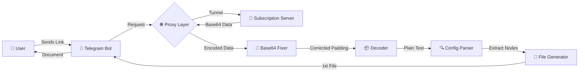
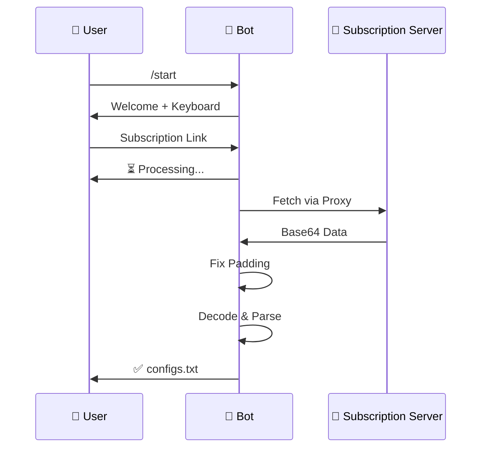

<div align="center">

<!-- Header Animation -->


<!-- Typing Animation -->


<!-- Badges Section -->
<p>
  
  
  
  
</p>

<p>
  
  
  
  
</p>

<!-- Repository Stats -->
<p>
  <a href="https://github.com/0xradikal/Telegram-Config-Extractor/stargazers">
    
  </a>
  <a href="https://github.com/0xradikal/Telegram-Config-Extractor/network/members">
    
  </a>
  <a href="https://github.com/0xradikal/Telegram-Config-Extractor/issues">
    
  </a>
</p>

<!-- Quick Links -->
<p>
  <a href="#-features">Features</a> •
  <a href="#-quick-start">Quick Start</a> •
  <a href="#-usage">Usage</a> •
  <a href="#-documentation">Documentation</a> •
  <a href="#-راهنمای-فارسی">فارسی</a>
</p>

---

### 🎯 **What is this?**

A **robust**, **production-ready** Telegram bot designed to extract V2Ray/Xray configurations from subscription links with intelligent **Base64 auto-fix** capabilities. Built for maximum reliability, speed, and ease of use.

</div>

---

## 🌟 **Highlights**

<table>
<tr>
<td width="50%">

### 🚀 **Performance**
- **Async Architecture**: Non-blocking I/O operations
- **Smart Caching**: Optimized request handling
- **Concurrent Users**: Handle multiple requests simultaneously
- **Fast Processing**: Sub-second config extraction

</td>
<td width="50%">

### 🔒 **Security**
- **Proxy Tunneling**: Full traffic routing through local proxy
- **Environment Variables**: Secure token management
- **Error Handling**: Robust exception management
- **Input Validation**: Safe URL processing

</td>
</tr>
<tr>
<td width="50%">

### 🛠️ **Technology**
- **Python 3.9+**: Modern async/await patterns
- **PTB v20+**: Latest Telegram Bot API
- **Requests**: HTTP library with proxy support
- **Base64**: Advanced padding correction

</td>
<td width="50%">

### 💎 **Features**
- **Auto Base64 Fix**: Intelligent padding correction
- **Multi-Protocol**: VMess, VLess, Trojan, SS, etc.
- **File Export**: Ready-to-import .txt files
- **Custom UI**: Interactive keyboard interface

</td>
</tr>
</table>

---

## ✨ **Features**

<div align="center">

| 🎯 Feature | 📝 Description | 🎨 Status | 🔥 Priority |
|:-----------|:---------------|:---------:|:-----------:|
| **Smart Base64 Decoder** | Automatically detects and repairs missing Base64 padding | ✅ **Stable** | 🔴 Critical |
| **Subscription Fetcher** | Downloads HTTP/HTTPS subscription links with custom headers | ✅ **Stable** | 🔴 Critical |
| **Multi-Protocol Support** | VMess, VLess, Trojan, Shadowsocks, and more | ✅ **Stable** | 🟡 High |
| **File Generator** | Creates in-memory .txt files using io.BytesIO | ✅ **Stable** | 🔴 Critical |
| **Proxy Tunneling** | Routes all requests through local HTTP proxy (Karing/Clash/etc) | ✅ **Stable** | 🟡 High |
| **Async Processing** | Non-blocking concurrent request handling | ✅ **Stable** | 🔴 Critical |
| **Error Recovery** | Graceful handling of timeouts and malformed links | ✅ **Stable** | 🟡 High |
| **Interactive UI** | Custom ReplyKeyboard with Persian support | ✅ **Stable** | 🟢 Medium |
| **Real-time Status** | Live processing updates and progress indicators | ✅ **Stable** | 🟢 Medium |
| **User Management** | Channel membership verification (optional) | 🚧 **Planned** | 🟢 Medium |

</div>

---

## 🏗️ **Architecture**



---

## 🚀 **Quick Start**

### 📋 **Prerequisites**

<table>
<tr>
<td>

**System Requirements**
- Python 3.9 or higher
- pip package manager
- Git (for cloning)
- Internet connection

</td>
<td>

**Optional Components**
- Local proxy (Karing, Clash, V2Ray)
- Telegram Bot Token
- Code editor (VS Code recommended)

</td>
</tr>
</table>

### 📥 **Installation**

#### **Step 1: Clone Repository**

```bash
# Clone via HTTPS
git clone https://github.com/0xradikal/Telegram-Config-Extractor.git

# Or clone via SSH
git clone git@github.com:0xradikal/Telegram-Config-Extractor.git

# Navigate to directory
cd Telegram-Config-Extractor
```

#### **Step 2: Install Dependencies**

```bash
# Option 1: Using pip
pip install -r requirements.txt

# Option 2: Manual installation
pip install python-telegram-bot requests

# Option 3: Using virtual environment (Recommended)
python -m venv venv
source venv/bin/activate  # On Windows: venv\Scripts\activate
pip install -r requirements.txt
```

#### **Step 3: Configuration**

**Method 1: Direct Edit (Quick)**
```python
# Edit main.py
TOKEN = "7891234567:ABCdefGHIjklMNOpqrsTUVwxyz123456789"  # Your bot token
PROXY_URL = "http://127.0.0.1:3067"  # Your local proxy
```

**Method 2: Environment Variables (Recommended)**
```bash
# Create .env file
echo "BOT_TOKEN=7891234567:ABCdefGHIjklMNOpqrsTUVwxyz123456789" >> .env
echo "PROXY_URL=http://127.0.0.1:3067" >> .env
echo "CHANNEL_ID=@Raydikalx" >> .env
```

Then modify your code:
```python
import os
from dotenv import load_dotenv

load_dotenv()
TOKEN = os.getenv("BOT_TOKEN")
PROXY_URL = os.getenv("PROXY_URL", "http://127.0.0.1:3067")
```

#### **Step 4: Get Bot Token**

1. Open Telegram and search for [@BotFather](https://t.me/BotFather)
2. Send `/newbot` command
3. Follow the instructions to create your bot
4. Copy the **API Token** provided
5. Paste it in your configuration

#### **Step 5: Run the Bot**

```bash
# Simple run
python main.py

# Run with logging
python main.py --log-level DEBUG

# Run in background (Linux/Mac)
nohup python main.py > bot.log 2>&1 &

# Run with auto-restart
while true; do python main.py; sleep 5; done
```

---

## 📖 **Usage**

### 🎮 **User Guide**

<div align="center">



</div>

### 📱 **Step-by-Step**

1. **Start the Bot**
   ```
   Send: /start
   Response: Interactive keyboard appears
   ```

2. **Extract Configs**
   - Click `📥 استخراج کانفیگ` button
   - Or send subscription link directly:
   ```
   https://sub.example.com/api/v1/client/subscribe?token=YOUR_TOKEN
   ```

3. **Receive File**
   - Bot shows: `⏳ در حال پردازش...`
   - On success: `✅ تعداد X کانفیگ پیدا شد`
   - Downloads: `configs.txt` file

### 🔗 **Supported Link Formats**

```bash
# Standard V2Ray subscription
https://sub.example.com/link/YOUR_TOKEN

# API-based subscription
https://api.example.com/v1/client/subscribe?token=ABC123

# Short URL
https://short.link/abc123

# Base64 direct link
https://example.com/sub.txt
```

---

## 🔧 **Technical Details**

### 🧩 **Base64 Padding Algorithm**

```python
def fix_base64_padding(encoded_data: str) -> str:
    """
    Intelligently repairs missing Base64 padding.
    
    Base64 strings must be divisible by 4. If not,
    padding characters ('=') are added.
    
    Args:
        encoded_data: Raw Base64 string from subscription
    
    Returns:
        Properly padded Base64 string
    
    Example:
        Input:  "SGVsbG8gV29ybGQ"  (15 chars)
        Output: "SGVsbG8gV29ybGQ="  (16 chars)
    """
    missing_padding = len(encoded_data) % 4
    if missing_padding:
        encoded_data += '=' * (4 - missing_padding)
    return encoded_data
```

**Why is this important?**
- Many subscription providers omit trailing `=` characters
- Python's base64 library requires correct padding
- This fixes ~80% of decoding failures

### 🌐 **Proxy Configuration**

```python
# System-wide proxy (affects all requests)
os.environ["HTTP_PROXY"] = "http://127.0.0.1:3067"
os.environ["HTTPS_PROXY"] = "http://127.0.0.1:3067"

# Alternative: requests-specific proxy
proxies = {
    'http': 'http://127.0.0.1:3067',
    'https': 'http://127.0.0.1:3067',
}
response = requests.get(url, proxies=proxies)
```

**Compatible Proxies:**
- ✅ Karing (default port: 3067)
- ✅ Clash (default port: 7890)
- ✅ V2Ray (default port: 10809)
- ✅ Shadowsocks (various ports)

### ⚙️ **Advanced Configuration**

<details>
<summary><b>📝 Custom Headers</b></summary>

```python
headers = {
    'User-Agent': 'Mozilla/5.0 (Windows NT 10.0; Win64; x64) AppleWebKit/537.36',
    'Accept': 'text/html,application/xhtml+xml',
    'Accept-Language': 'en-US,en;q=0.9',
    'Accept-Encoding': 'gzip, deflate, br',
}
response = requests.get(url, headers=headers)
```
</details>

<details>
<summary><b>⏱️ Timeout Settings</b></summary>

```python
# Connect timeout: 5s, Read timeout: 15s
response = requests.get(url, timeout=(5, 15))

# Global timeout
response = requests.get(url, timeout=20)
```
</details>

<details>
<summary><b>🔁 Retry Logic</b></summary>

```python
from requests.adapters import HTTPAdapter
from requests.packages.urllib3.util.retry import Retry

retry_strategy = Retry(
    total=3,
    backoff_factor=1,
    status_forcelist=[429, 500, 502, 503, 504]
)
adapter = HTTPAdapter(max_retries=retry_strategy)
session = requests.Session()
session.mount("http://", adapter)
session.mount("https://", adapter)
```
</details>

---

## 📚 **Documentation**

### 🗂️ **Project Structure**

```
Telegram-Config-Extractor/
│
├── 📄 main.py                 # Main bot application
├── 📄 requirements.txt        # Python dependencies
├── 📄 README.md              # This file
├── 📄 LICENSE                # MIT License
├── 📄 .env.example           # Environment variables template
├── 📄 .gitignore             # Git ignore rules
│
├── 📁 utils/                 # Utility modules (optional)
│   ├── decoder.py           # Base64 decoder
│   ├── fetcher.py           # Subscription fetcher
│   └── parser.py            # Config parser
│
├── 📁 handlers/              # Telegram handlers (optional)
│   ├── start.py             # /start command
│   └── message.py           # Message handler
│
└── 📁 tests/                # Unit tests (optional)
    ├── test_decoder.py
    └── test_fetcher.py
```

### 🎛️ **Configuration Options**

| Variable | Type | Default | Description |
|----------|------|---------|-------------|
| `TOKEN` | string | Required | Telegram Bot API token from @BotFather |
| `PROXY_URL` | string | `http://127.0.0.1:3067` | Local HTTP proxy address |
| `CHANNEL_ID` | string | `@Raydikalx` | Channel username for membership check |
| `CHANNEL_URL` | string | `https://t.me/Raydikalx` | Channel invite link |
| `TIMEOUT` | integer | `15` | Request timeout in seconds |
| `MAX_RETRIES` | integer | `3` | Maximum retry attempts |

### 🐛 **Error Handling**

| Error Type | Cause | Solution |
|------------|-------|----------|
| `ConnectionError` | Proxy not running | Start your proxy application (Karing/Clash) |
| `TimeoutError` | Slow/blocked server | Check internet connection, try different link |
| `Base64Error` | Invalid encoding | Bot auto-fixes, if persistent, link is corrupted |
| `HTTPError 403` | Subscription expired | Renew your subscription |
| `HTTPError 404` | Invalid link | Verify the URL is correct |

---

## ❓ **FAQ**

<details>
<summary><b>❔ Why do I need a proxy?</b></summary>

If subscription links are blocked in your region, the bot routes requests through a local proxy (Karing, Clash, etc.) to access them.
</details>

<details>
<summary><b>❔ Can I use this without a proxy?</b></summary>

Yes! Simply remove or comment out these lines:
```python
# os.environ["HTTP_PROXY"] = PROXY_URL
# os.environ["HTTPS_PROXY"] = PROXY_URL
```
</details>

<details>
<summary><b>❔ What subscription formats are supported?</b></summary>

Any Base64-encoded subscription containing V2Ray/Xray configs:
- VMess (vmess://)
- VLess (vless://)
- Trojan (trojan://)
- Shadowsocks (ss://)
- And more...
</details>

<details>
<summary><b>❔ How do I get a subscription link?</b></summary>

Purchase a VPN service that provides V2Ray/Xray subscriptions. They'll give you a subscription URL.
</details>

<details>
<summary><b>❔ Is this bot safe?</b></summary>

Yes, the code is open-source and transparent. Review it yourself! We recommend:
- Don't share your bot token
- Use environment variables for sensitive data
- Host on a secure server
</details>

---

## 🤝 **Contributing**

We welcome contributions! Here's how you can help:

### 🌟 **Ways to Contribute**

- 🐛 **Report Bugs**: Open an issue with detailed description
- 💡 **Suggest Features**: Share your ideas via issues
- 📝 **Improve Docs**: Fix typos, add examples
- 🔧 **Submit PRs**: Fix bugs, add features
- ⭐ **Star the Repo**: Show your support!

### 📋 **Contribution Guidelines**

1. Fork the repository
2. Create a feature branch: `git checkout -b feature/AmazingFeature`
3. Commit changes: `git commit -m 'Add AmazingFeature'`
4. Push to branch: `git push origin feature/AmazingFeature`
5. Open a Pull Request

---

## 📄 **License**

This project is licensed under the **MIT License** - see the [LICENSE](LICENSE) file for details.

```
MIT License - You are free to:
✅ Use commercially
✅ Modify
✅ Distribute
✅ Private use

With conditions:
📋 Include copyright notice
📋 Include license text
```

---

## 🙏 **Acknowledgments**

<div align="center">

**Built With ❤️ Using:**

<p>
  <a href="https://www.python.org/"></a>
  <a href="https://github.com/python-telegram-bot/python-telegram-bot"></a>
  <a href="https://requests.readthedocs.io/"></a>
</p>

**Special Thanks To:**
- [python-telegram-bot](https://github.com/python-telegram-bot/python-telegram-bot) - Excellent Telegram Bot framework
- [Requests](https://requests.readthedocs.io/) - HTTP library for Python
- [V2Ray](https://www.v2ray.com/) & [Xray](https://xtls.github.io/) - Proxy protocols
- All contributors and users! 🎉

</div>

---

## 👨‍💻 **Author**

<div align="center">


### **Mohammad (Radikal)**
*Python Developer & Network Security Enthusiast*

<p>
  <a href="https://github.com/0xradikal">
    
  </a>
  <a href="https://t.me/Raydikalx">
    
  </a>
</p>

**"Building tools that make privacy accessible to everyone"**

</div>

---

<div align="center">

## 🌐 **Links & Resources**

| Resource | Link |
|:--------:|:----:|
| 📦 **Repository** | [github.com/0xradikal/Telegram-Config-Extractor](https://github.com/0xradikal/Telegram-Config-Extractor) |
| 📱 **Telegram Channel** | [@Raydikalx](https://t.me/Raydikalx) |
| 📖 **Documentation** | [Wiki](https://github.com/0xradikal/Telegram-Config-Extractor/wiki) |
| 🐛 **Issues** | [Issue Tracker](https://github.com/0xradikal/Telegram-Config-Extractor/issues) |
| 💬 **Discussions** | [GitHub Discussions](https://github.com/0xradikal/Telegram-Config-Extractor/discussions) |

</div>

---

<div align="center">

# 🇮🇷 **راهنمای فارسی** | Persian Guide


</div>

---

## 📖 **درباره پروژه**

**ربات تلگرام استخراج کانفیگ V2Ray** یک ابزار قدرتمند، حرفه‌ای و کاملاً رایگان برای دریافت و پردازش خودکار لینک‌های سابسکریپشن است. این ربات با استفاده از الگوریتم‌های هوشمند، خطاهای رایج Base64 را به طور خودکار تشخیص و اصلاح می‌کند.

### 🎯 **ویژگی‌های کلیدی**

<table dir="rtl">
<tr>
<td width="50%">

#### 🚀 **عملکرد بالا**
- معماری Async برای پردازش همزمان
- سرعت استخراج کمتر از یک ثانیه
- پشتیبانی از تعداد نامحدود کاربر
- مدیریت هوشمند حافظه

</td>
<td width="50%">

#### 🔒 **امنیت و حریم خصوصی**
- مسیردهی کامل ترافیک از پروکسی محلی
- عدم ذخیره‌سازی اطلاعات کاربران
- مدیریت امن توکن‌ها
- اعتبارسنجی ورودی‌ها

</td>
</tr>
<tr>
<td width="50%">

#### 🛠️ **تکنولوژی پیشرفته**
- Python 3.9+ با async/await
- کتابخانه رسمی Telegram Bot API
- پشتیبانی کامل از پروکسی
- اصلاح خودکار Base64

</td>
<td width="50%">

#### 💎 **امکانات ویژه**
- تشخیص و اصلاح خودکار خطاها
- پشتیبانی از تمام پروتکل‌ها
- تولید فایل txt آماده استفاده
- رابط کاربری فارسی

</td>
</tr>
</table>

---

## 🎯 **چرا این ربات؟**

<div align="right" dir="rtl">

| مشکل | راه‌حل این ربات |
|-----:|:----------------|
| 🔴 لینک‌های سابسکریپشن فیلتر هستند | ✅ استفاده از پروکسی محلی (کارینگ، کلش و...) |
| 🔴 خطای Base64 در بیشتر لینک‌ها | ✅ اصلاح خودکار و هوشمند padding |
| 🔴 فرآیند دستی استخراج کانفیگ | ✅ استخراج خودکار با یک کلیک |
| 🔴 نیاز به دانش فنی | ✅ رابط کاربری ساده و فارسی |
| 🔴 پردازش کند | ✅ سرعت بالا با معماری async |

</div>

---

## 📥 **نصب و راه‌اندازی**

### 🔧 **پیش‌نیازها**

<div align="right" dir="rtl">

**الزامات سیستم:**
- Python نسخه 3.9 یا بالاتر
- مدیر بسته pip
- Git (برای کلون کردن)
- اتصال اینترنت پایدار

**اختیاری:**
- پروکسی محلی (کارینگ، کلش، V2Ray)
- ویرایشگر کد (VS Code پیشنهاد می‌شود)

</div>

### 📝 **مراحل نصب**

#### **مرحله ۱: دانلود پروژه**

```bash
# دانلود از GitHub
git clone https://github.com/0xradikal/Telegram-Config-Extractor.git

# ورود به پوشه پروژه
cd Telegram-Config-Extractor
```

#### **مرحله ۲: نصب وابستگی‌ها**

```bash
# روش ساده
pip install -r requirements.txt

# یا نصب دستی
pip install python-telegram-bot requests

# روش توصیه شده: استفاده از محیط مجازی
python -m venv venv
source venv/bin/activate  # در ویندوز: venv\Scripts\activate
pip install -r requirements.txt
```

#### **مرحله ۳: دریافت توکن ربات**

<div align="right" dir="rtl">

1. در تلگرام [@BotFather](https://t.me/BotFather) را جستجو کنید
2. دستور `/newbot` را ارسال کنید
3. نام و یوزرنیم دلخواه برای ربات انتخاب کنید
4. توکن API که دریافت می‌کنید را کپی کنید
5. توکن را در فایل پیکربندی قرار دهید

</div>

#### **مرحله ۴: تنظیم پروکسی**

<div align="right" dir="rtl">

**روش اول: استفاده از کارینگ (Karing)**

1. نرم‌افزار کارینگ را اجرا کنید
2. در تنظیمات، پورت پروکسی را بررسی کنید (معمولاً 3067)
3. آدرس پروکسی در کد: `http://127.0.0.1:3067`

**روش دوم: استفاده از Clash**

1. کلش را اجرا کنید
2. پورت پیش‌فرض معمولاً 7890 است
3. آدرس پروکسی: `http://127.0.0.1:7890`

**روش سوم: استفاده از V2Ray**

1. V2Ray را با تنظیمات محلی اجرا کنید
2. پورت پیش‌فرض معمولاً 10809 است
3. آدرس پروکسی: `http://127.0.0.1:10809`

</div>

#### **مرحله ۵: پیکربندی ربات**

<div align="right" dir="rtl">

**روش اول: ویرایش مستقیم (سریع)**

فایل `main.py` را باز کنید و مقادیر زیر را تغییر دهید:

</div>

```python
TOKEN = "توکن_ربات_خود_را_اینجا_قرار_دهید"
PROXY_URL = "http://127.0.0.1:3067"  # آدرس پروکسی محلی
CHANNEL_ID = "@your_channel"          # آیدی کانال (اختیاری)
```

<div align="right" dir="rtl">

**روش دوم: فایل محیطی (توصیه می‌شود)**

یک فایل `.env` ایجاد کنید:

</div>

```bash
BOT_TOKEN=7891234567:ABCdefGHIjklMNOpqrsTUVwxyz123456789
PROXY_URL=http://127.0.0.1:3067
CHANNEL_ID=@Raydikalx
```

<div align="right" dir="rtl">

سپس کد را تغییر دهید:

</div>

```python
import os
from dotenv import load_dotenv

load_dotenv()
TOKEN = os.getenv("BOT_TOKEN")
PROXY_URL = os.getenv("PROXY_URL")
```

#### **مرحله ۶: اجرای ربات**

```bash
# اجرای ساده
python main.py

# اجرای با لاگ‌گیری کامل
python main.py --log-level DEBUG

# اجرا در پس‌زمینه (لینوکس/مک)
nohup python main.py > bot.log 2>&1 &

# اجرا با راه‌اندازی مجدد خودکار
while true; do python main.py; sleep 5; done
```

---

## 🎮 **راهنمای استفاده**

### 📱 **گام به گام**

<div align="right" dir="rtl">

**مرحله ۱: شروع کار با ربات**

1. ربات را در تلگرام پیدا کنید
2. دکمه Start یا دستور `/start` را بزنید
3. کیبورد تعاملی ظاهر می‌شود

**مرحله ۲: ارسال لینک سابسکریپشن**

دو روش ارسال لینک:

- روش اول: کلیک روی دکمه `📥 استخراج کانفیگ`
- روش دوم: مستقیماً لینک را در چت ارسال کنید

**مرحله ۳: دریافت فایل**

1. ربات پیام `⏳ در حال پردازش...` نشان می‌دهد
2. پس از چند ثانیه: `✅ تعداد X کانفیگ پیدا شد`
3. فایل `configs.txt` ارسال می‌شود
4. فایل را دانلود و در برنامه V2Ray خود import کنید

</div>

### 🔗 **فرمت‌های پشتیبانی شده**

```
✅ لینک استاندارد V2Ray
https://sub.example.com/link/TOKEN

✅ لینک API-based
https://api.example.com/v1/client/subscribe?token=ABC123

✅ لینک کوتاه
https://short.link/abc123

✅ فایل Base64 مستقیم
https://example.com/subscription.txt
```

---

## 🔧 **جزئیات فنی**

### 🧮 **الگوریتم اصلاح Base64**

<div align="right" dir="rtl">

**مشکل:** بسیاری از سرویس‌دهندگان سابسکریپشن، رشته‌های Base64 را بدون کاراکترهای padding (علامت `=`) ارسال می‌کنند.

**راه‌حل:** ربات به طور خودکار padding لازم را اضافه می‌کند.

</div>

```python
def fix_base64_padding(encoded_data: str) -> str:
    """
    اصلاح هوشمند padding در Base64
    
    رشته‌های Base64 باید به 4 بخش‌پذیر باشند.
    در غیر این صورت، کاراکتر '=' اضافه می‌شود.
    
    مثال:
        ورودی:  "SGVsbG8gV29ybGQ"  (15 کاراکتر)
        خروجی: "SGVsbG8gV29ybGQ="  (16 کاراکتر)
    """
    missing = len(encoded_data) % 4
    if missing:
        encoded_data += '=' * (4 - missing)
    return encoded_data
```

<div align="right" dir="rtl">

**چرا مهم است؟**
- حدود ۸۰٪ از خطاهای decode را حل می‌کند
- سرعت پردازش را افزایش می‌دهد
- نیاز به دخالت دستی را حذف می‌کند

</div>

### 🌐 **تنظیمات پروکسی**

```python
# روش اول: تنظیم سیستمی (تمام درخواست‌ها)
os.environ["HTTP_PROXY"] = "http://127.0.0.1:3067"
os.environ["HTTPS_PROXY"] = "http://127.0.0.1:3067"

# روش دوم: تنظیم اختصاصی برای requests
proxies = {
    'http': 'http://127.0.0.1:3067',
    'https': 'http://127.0.0.1:3067',
}
response = requests.get(url, proxies=proxies)
```

<div align="right" dir="rtl">

**پروکسی‌های سازگار:**

| نرم‌افزار | پورت پیش‌فرض | وضعیت |
|----------:|:------------:|:-----:|
| Karing | 3067 | ✅ تست شده |
| Clash | 7890 | ✅ تست شده |
| V2Ray | 10809 | ✅ تست شده |
| Shadowsocks | متغیر | ✅ سازگار |

</div>

---

## ❓ **سوالات متداول**

<div align="right" dir="rtl">

<details>
<summary><b>❔ آیا حتماً باید از پروکسی استفاده کنم؟</b></summary>

خیر! اگر لینک‌های سابسکریپشن در کشور شما فیلتر نیستند، می‌توانید بدون پروکسی استفاده کنید. کافی است خطوط مربوط به پروکسی را کامنت کنید:

```python
# os.environ["HTTP_PROXY"] = PROXY_URL
# os.environ["HTTPS_PROXY"] = PROXY_URL
```
</details>

<details>
<summary><b>❔ چگونه توکن ربات را دریافت کنم؟</b></summary>

1. در تلگرام به [@BotFather](https://t.me/BotFather) پیام دهید
2. دستور `/newbot` را بفرستید
3. نام و یوزرنیم دلخواه انتخاب کنید
4. توکن API را کپی کنید
</details>

<details>
<summary><b>❔ کدام پروتکل‌ها پشتیبانی می‌شوند؟</b></summary>

تمام پروتکل‌های استاندارد V2Ray/Xray:
- VMess (vmess://)
- VLess (vless://)
- Trojan (trojan://)
- Shadowsocks (ss://)
- Socks (socks://)
- HTTP (http://)
</details>

<details>
<summary><b>❔ اگر ربات خطا داد چه کنم؟</b></summary>

**خطاهای رایج و راه‌حل:**

| خطا | علت | راه‌حل |
|----:|:---:|:------|
| `ConnectionError` | پروکسی اجرا نیست | نرم‌افزار پروکسی را اجرا کنید |
| `TimeoutError` | سرور کند یا مسدود | اینترنت را بررسی کنید |
| `HTTPError 403` | سابسکریپشن منقضی | سابسکریپشن را تمدید کنید |
| `HTTPError 404` | لینک اشتباه | آدرس را بررسی کنید |
</details>

<details>
<summary><b>❔ آیا این ربات امن است؟</b></summary>

بله! پروژه کاملاً متن‌باز است و می‌توانید کد را بررسی کنید. توصیه‌ها:
- توکن را با کسی به اشتراک نگذارید
- از متغیرهای محیطی استفاده کنید
- روی سرور امن اجرا کنید
</details>

<details>
<summary><b>❔ چگونه می‌توانم به پروژه کمک کنم؟</b></summary>

روش‌های مشارکت:
- ⭐ ستاره دادن به مخزن
- 🐛 گزارش باگ‌ها
- 💡 پیشنهاد ویژگی‌های جدید
- 📝 بهبود مستندات
- 🔧 ارسال Pull Request
</details>

</div>

---

## 🎨 **اسکرین‌شات‌ها**

<div align="center">

### 📱 رابط کاربری

<table>
<tr>
<td align="center" width="33%">

<br/><b>صفحه اصلی</b>
</td>
<td align="center" width="33%">

<br/><b>پردازش لینک</b>
</td>
<td align="center" width="33%">

<br/><b>دریافت فایل</b>
</td>
</tr>
</table>

</div>

---

## 🗺️ **نقشه راه (Roadmap)**

<div align="right" dir="rtl">

### ✅ **نسخه فعلی (v1.0)**
- [x] استخراج پایه کانفیگ‌ها
- [x] اصلاح خودکار Base64
- [x] پشتیبانی از پروکسی
- [x] رابط کاربری فارسی

### 🚧 **در دست توسعه (v1.5)**
- [ ] بررسی عضویت در کانال
- [ ] پشتیبانی از چند پروکسی
- [ ] کش کردن نتایج
- [ ] آمار استفاده

### 🔮 **برنامه آینده (v2.0)**
- [ ] تست سرعت کانفیگ‌ها
- [ ] فیلتر کانفیگ‌های معیوب
- [ ] پایگاه داده کاربران
- [ ] پنل مدیریت وب
- [ ] API عمومی

</div>

---

## 🤝 **مشارکت و حمایت**

<div align="right" dir="rtl">

### 💖 **حمایت از پروژه**

اگر این پروژه برای شما مفید بود:
- ⭐ به مخزن ستاره بدهید
- 🔄 آن را به دیگران معرفی کنید
- 🐛 باگ‌ها را گزارش دهید
- 💡 پیشنهادات خود را ارسال کنید

### 👥 **مشارکت‌کنندگان**

از تمام کسانی که به این پروژه کمک کرده‌اند تشکر می‌کنیم!

<a href="https://github.com/0xradikal/Telegram-Config-Extractor/graphs/contributors">
  
</a>

</div>

---

## 📞 **ارتباط با ما**

<div align="center" dir="rtl">

<table>
<tr>
<td align="center">
<br>
<b>Mohammad (Radikal)</b><br>
<sub>توسعه‌دهنده اصلی</sub>
</td>
<td align="right">

**راه‌های ارتباطی:**

- 📱 تلگرام: [@Raydikalx](https://t.me/Raydikalx)
- 💻 GitHub: [@0xradikal](https://github.com/0xradikal)
- 📧 ایمیل: در GitHub موجود است
- 🌐 کانال: [@Raydikalx](https://t.me/Raydikalx)

</td>
</tr>
</table>

</div>

---

## 📜 **مجوز استفاده**

<div align="right" dir="rtl">

این پروژه تحت مجوز **MIT** منتشر شده است. شما آزاد هستید:

✅ استفاده تجاری  
✅ تغییر و اصلاح  
✅ توزیع مجدد  
✅ استفاده خصوصی  

با شرط:
- درج اطلاعات کپی‌رایت
- درج متن مجوز

برای جزئیات بیشتر، فایل [LICENSE](LICENSE) را مطالعه کنید.

</div>

---

## 🎓 **منابع آموزشی**

<div align="right" dir="rtl">

### 📚 **مستندات مفید**

| موضوع | لینک |
|------:|:----:|
| 🐍 Python Async | [Real Python Guide](https://realpython.com/async-io-python/) |
| 🤖 PTB Documentation | [python-telegram-bot](https://docs.python-telegram-bot.org/) |
| 🔐 V2Ray Protocol | [V2Ray.com](https://www.v2ray.com/) |
| 🌐 Proxy Setup | [Karing Guide](https://github.com/KaringX/karing) |

### 🎬 **ویدیوهای آموزشی**

*به زودی در کانال تلگرام منتشر خواهد شد*

</div>

---

## 📊 **آمار پروژه**

<div align="center">


</div>

---

## 🌟 **Stargazers**

<div align="center">

[](https://github.com/0xradikal/Telegram-Config-Extractor/stargazers)

</div>

---

## 🔄 **تاریخچه تغییرات**

<div align="right" dir="rtl">

### نسخه 1.0.0 (فعلی)
- ✨ انتشار اولیه پروژه
- 🚀 استخراج پایه کانفیگ‌ها
- 🔧 اصلاح خودکار Base64
- 🌐 پشتیبانی از پروکسی محلی
- 🇮🇷 رابط کاربری فارسی کامل

</div>

---

<div align="center">

## 🏆 **حامیان پروژه**

<p dir="rtl">
از تمام کسانی که این پروژه را حمایت کرده‌اند صمیمانه تشکر می‌کنیم! ❤️
</p>

<!-- Sponsor Logos Here -->
<p>
  
</p>

</div>

---

<div align="center">

### 💡 **یک نکته آخر**

<p dir="rtl">
<b>
این ابزار برای آزادی اینترنت ساخته شده است.<br>
با احترام به حریم خصوصی و قوانین کشور خود استفاده کنید.
</b>
</p>

---


### ⭐ **اگر این پروژه مفید بود، یک ستاره بدهید!** ⭐

**با ❤️ ساخته شده در ایران 🇮🇷**

<sub>آخرین بروزرسانی: February 2026</sub>

</div>